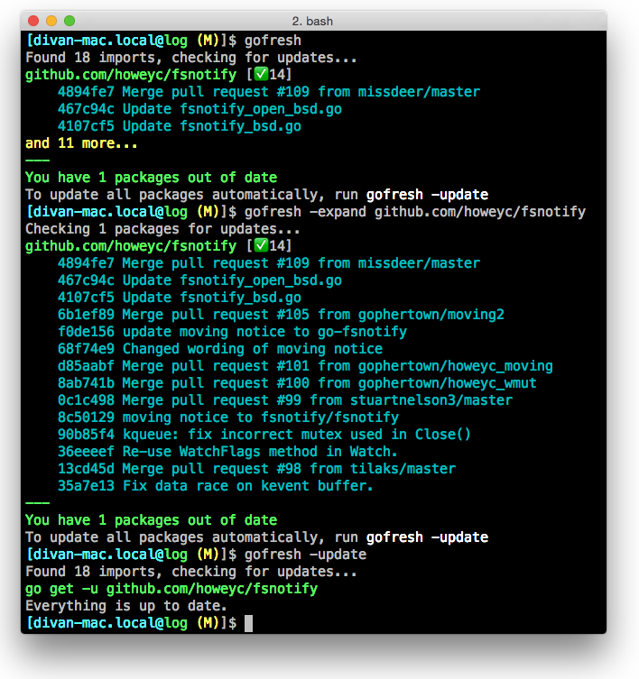

# GoFresh

[](https://drone.io/github.com/divan/gofresh/latest)

Keep your Go package dependencies fresh. Console tool for checking and updating package dependencies (imports).

## Introduction

GoFresh checks if there are any updates for imports in your package. It doesn't update packages, unless asked explicitly.

## Demo


## Installation

Just run go get:

    go get github.com/divan/gofresh

## Usage

Simply invoke **gofresh** inside a directory containing Go source files and it will tell you if you have any updates for your imports.

    gofresh

To check a package in your $GOPATH, you can specify the exact package by name:

    gofresh golang.org/x/tools/go/vcs

By default, it shows first 3 commits, but you can expand commits list using -expand flag. See -help for more details.

    $ gofresh -h
	gofresh [-options]
	gofresh [-options] [package(s)]
	Options:
	  -dry-run=false: Dry run
	  -expand=false: Expand list of commits
	  -update=false: Update all packages


Using -update flag you can update automatically all packages.

If you want to update them manually, use following flags to see the commands to invoke:

    gofresh -update -dry-run


## Workflow

Typically, you simply invoke **gofresh** in your package dir to see what dependencies has been changed. Then you might want to see all new commits for the specific package and update it manually or update all automatically:

    $ cd src/github.com/myusername/myproject/
    $ gofresh
    $ gofresh -expand github.com/howeyc/fsnotify
    $ gofresh -update



## Using with vendoring tools

If you use vendoring tool, such as Godep, your workflow doesn't change much:

* First, use gofresh to inspect updates and update if needed
* Second, run ```godep save``` or similar to update vendor dir from your GOPATH
* Commit update

## Issues

* No support for Bazaar & SVN *(how to check new commits on them?)*
* Missing/failed repositories are not reported (no way to identify error from vcs.RepoRootForImportPath)
* Subpackages from the same repo will be checked all anyway (TODO: optimize)

## License

This program is under [WTFPL license](http://www.wtfpl.net)
