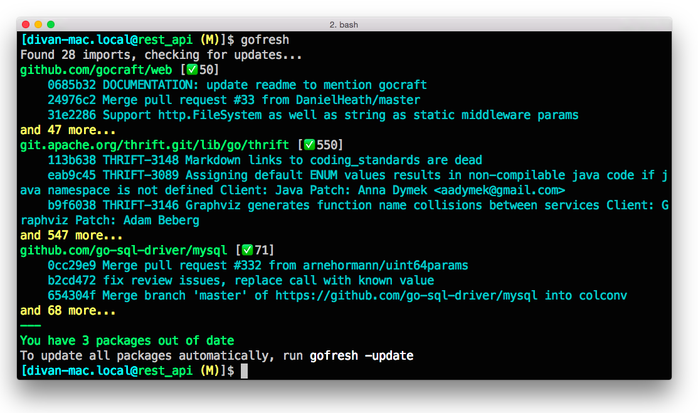
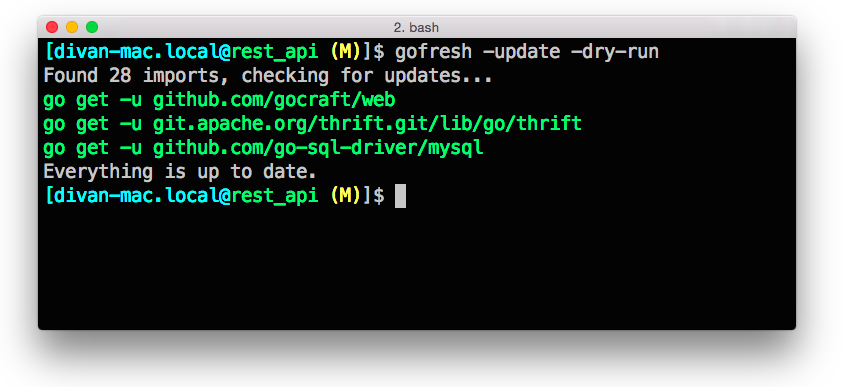

# GoFresh

Keep your Go package dependencies fresh. Console tool for checking and updating package dependencies (imports).

## Introduction

GoFresh checks if there are any updates for imports in your package. It doesn't update packages, unless asked explicitly.

## Demo

## Installation

Just run go get:

    go get github.com/divan/gofresh

## Usage

Simply invoke *gofresh* and it will tell you if you have any updates for your imports.
By default, it shows first 3 commits, but you can expand commits list using -expand flag. See -help for more details.

    gofresh -h
    Usage of gofresh:
      -dry-run=false: Dry run
      -expand=false: Expand list of commits
      -update=false: Update all packages

Using -update flag you can update automatically all packages.

If you want to update them manually, use following flags to see the commands to invoke:

    gofresh -update -dry-run

## License

This program is under [WTFPL license](http://www.wtfpl.net)
